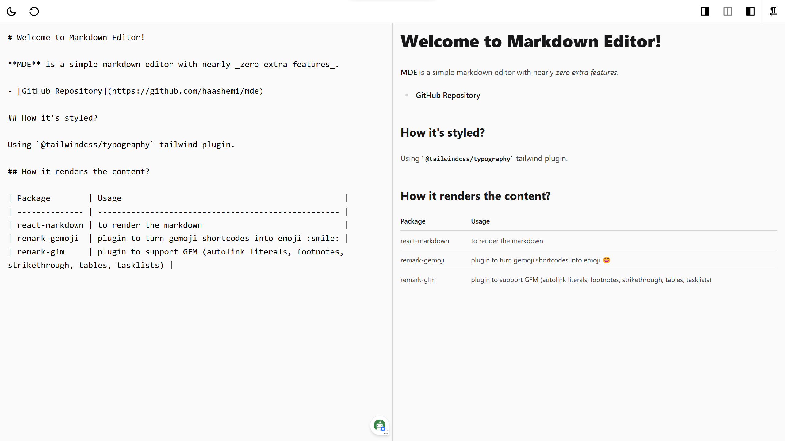

# MDE

[MDE](https://mde.haashemi.dev) is a simple web-based markdown editor with the features that you actually need.

## How it works?

It's made of just a `textarea` for input and an `article` for the rendered markdown. The markdown input is rendered using [react-markdown](https://github.com/remarkjs/react-markdown) with `remark-gfm` and `remark-gemoji` plugins. RTL support happens by changing the direction of almost the whole app.



## Usage

To use this project, you can use both the hosted version, or selfhost it by yourself.

### Hosted version

Visit [mde.haashemi.dev](https://mde.haashemi.dev)

### Selfhost it

1. Build the project

```
# Install dependencies
pnpm install
# Build the project
pnpm build
```

2. Host the `dist` directory with something like NginX

## Roadmap

Here are some features that I _might_ add to mde someday.
(_These are not in any particular order._)

- Implement a fully functional PWA
- Implement a better editor section (e.g., Syntax Highlight)
- Update the scrollbar of the panels
- Implement a full-screen menu
  - Implement remark/rehype plugin toggle menu
  - ~~Implement a reset button~~
  - Implement a capture preview button
  - Implement a recent documents menu

## Contributions

If you're willing to help this project get better in any way, your contribution is highly appreciated.
